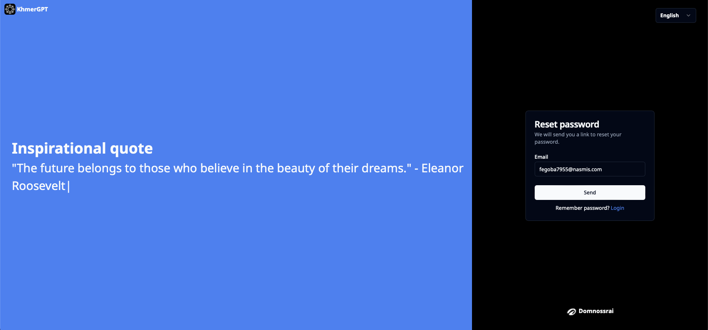

# Reset Password

If you have forgotten your password or need to reset it, please follow the steps below:

### Step 1: Visit the Password Reset Page

> Go to https://chat.domnossrai.com/reset-password

### Step 2: Enter Your Email Address

On the password reset page, enter the email address associated with your account.

(Desktop view)

(Mobile view)

### Step 3: Verification

You will receive an email containing a verification link. Click on the button "Reset Password" to verify your identity.

### Step 4: Create a New Password

Once verified, you will be prompted to create a new password. Choose a strong password that includes a combination of uppercase and lowercase letters, numbers, and special characters. and confirm your new password by entering it again.

(Mobile view)

### Step 5: Login

Return to the login page and use your newly reset password to access your account.

> Go to https://chat.domnossrai.com/login
